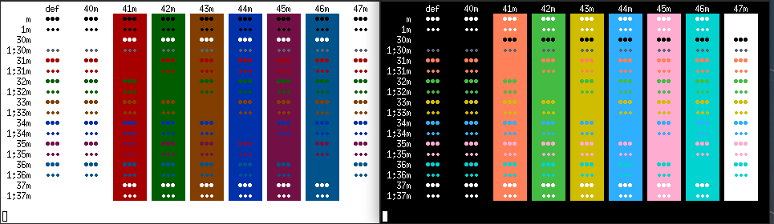

<h3 align="center">
	 
	Modus themes for Xresources
</h3>

## Usage

1. `$ git clone https://github.com/modus-themes/xresources`.
2. Pick between Modus Operandi and Modus Vivendi
3. If you picked Modus Vivendi, skip to step 5 
4. Load Modus Operandi by: `xrdb merge $pwd Xresources.operandi`
5. Load Modus Vivendi by: `xrdb merge $pwd Xresources.vivendi`

# Preview
<h4 align="center">
	Modus Operandi & Modus Vivendi
</h4>

# Credits
- [pacbru1260](https://github.com/pacbru1260)
